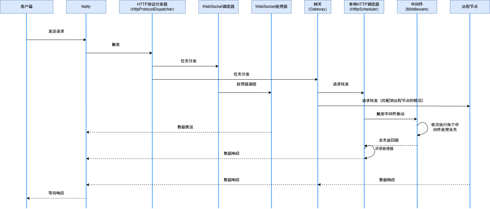

# 
# TurboWeb

## 简介

你还在为选择“同步简单”还是“异步高性能”而左右为难？

别纠结了！**TurboWeb** 就是为你而生的框架 —— 用同步的方式，干掉异步的活儿。

**TurboWeb是什么?** 

TurboWeb 是一个**现代、高性能、无废话**的 Java Web 框架。它是Netty和JDK21虚拟线程的结合体，天生就是为高并发场景设计的，底层快得飞起，上层写起来却像春风拂面。

你写的就是普通的 Java 同步代码，但跑出来的性能，能让异步框架汗颜。你不需要理解什么回调地狱、响应流、Mono/Flux，只管写 `HttpContext`，剩下的交给它搞定。

**为什么选择TurboWeb？** 

- 同步开发体验：得益于 JDK21 的 Loom 支持，TurboWeb 使用虚拟线程（而非传统线程池）执行请求处理。你写的仍是同步代码，却可以支撑数十万并发请求。
- 灵活的中间件架构：对于普通HTTP请求的处理，TurboWeb采用了中间件驱动的架构，功能的扩展都是基于中间件来实现的，例如：跨域设置、限流、模板技术......，就连controller也是框架内部的一个中间件进行处理的。
- WebSocket与SSE的原生集成：支持长连接的原生能力，无需额外依赖，轻松构建IM、实时数据推送系统。
- 简洁的路由与控制器模型：使用注解声明路由，所有方法参数统一为``HttpContext``，开发者拥有完全控制权，框架只提供简化的API，不做多余的干涉，由于方法参数统一，框架的控制器调度采用了``方法句柄``来避免大量反射造成的开销。
- 服务间路由共享：不依赖中心化的网关，各个节点之间可以互相暴露API，实现更加灵活的微服务架构。
- 同时支持同步风格编程：TurboWeb虽然使用同步编程也能带来高性能，但是同时也是支持反应式编程。

**TurboWeb的请求处理流程**

接下来一起进入TurboWeb：

[目录](./docs/sync/guide.md)

